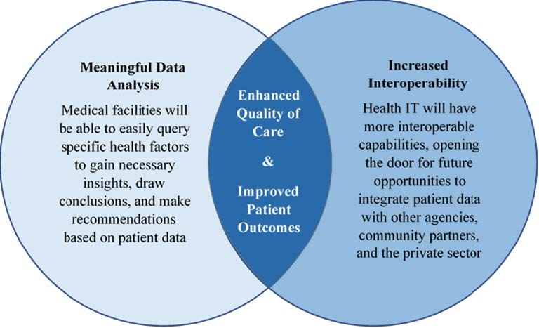

## Tinkar Overview

Over the past decades, biomedical terminologies have increasingly been recognized as key resources for knowledge management, data integration, and decision support [1]. Acceleration and development of Electronic Health Record (EHR) systems has precipitated the emergence of “standard terminologies” and their widespread adoption in the clinical community. These include Systematized Nomenclature of Medicine Clinical Terms (SNOMED CT®), the Logical Observation Identifiers, Names, and Codes (LOINC®) and RxNorm. The availability of these clinical terminologies through the terminology services of FHIR is facilitating their usage in support of interoperability in healthcare. 

Interoperability requires standardized semantics based on reference terminology provided by standards development organizations, professional organizations, or government agencies. These organizations publish their content with the intention of licensing it to health IT vendors, providers, and research organizations. In the U.S., the core clinical reference terminology is based on SNOMED CT®, LOINC®, and RxNorm. Healthcare organizations must adopt and integrate subsets or modules of various reference terminology and manage references, dependencies, versions, and releases. It is important for the integrity of medical records that the change history of concepts and value sets can be managed and tracked to allow the exchange of either current or retrospective medical records. Therefore, enterprise terminology requires integrated terminology using a common representation and management. 

Despite the need to use standard terminologies in a highly integrated way, there is no standard representation across SNOMED CT®, LOINC®, RxNorm, etc. Some partnerships have been created among development teams to facilitate interoperability and minimize duplication of effort. Further integration has been proposed but will require additional resources to bring these terminologies closer together. However, while this evolution leads to greater compatibility and interoperability, integration of SNOMED CT®, LOINC®, and RxNorm is non-trivial as these terminologies use different formalisms and tools for their representation. Various terminologies have different semantics, models, release cycles, and versioning mechanisms [1]. While there is recognition that terminologies are not standardized at the exchange level, there is no consensus about harmonized next steps to solve the challenges. 

This document focuses on the need for – and logical specification of – a Terminology Knowledge Architecture (Tinkar). The Tinkar Reference Model is a logical model that describes the standardized model for terminology and change management. Tinkar provides an architecture that delivers integrated terminology to the enterprise and its information systems. In doing so, it addresses the differences in management and structure across reference terminology, local concepts, and code lists/value sets. 

The Capability Maturity Model is a development model and can be viewed as a set of structured levels that describe how well the behaviors, practices, and processes of an organization can reliably and sustainably produce required outcomes. There are five levels defined along the continuum of the Capability Maturity Model (see below). The model provides a theoretical continuum along which process maturity can be developed incrementally from one level to the next. An implementation of the Tinkar Specification can provide a single representation for all terminologies required in the U.S. and other countries, while also providing a better foundation for maturing change management models as described by the Capability  Maturity Model [2]:

1. **Initial** – Tinkar aims to reduce and eliminate challenges with management of changes to terminology
being unpredictable, poorly controlled, and reactive.
2. **Repeatable** – Tinkar provides the foundation for robust configuration management and quality assurance
for terminologies.
3. **Defined** – Tinkar allows terminologies to have standardized update and extension processes.
4. **Managed** – Tinkar represents updates and changes to terminologies so that the changes can be measured
and controlled.
5. **Optimizing** – Tinkar aims to allow multiple stakeholders to apply and retrieve changes to shared terminology
content with equivalent and harmonized results.

Tinkar aims to adhere to the following statement from a publication about developments in clinical terminologies in the 2018 Yearbook of Medical Informatics [1]: “The benefits of the integrated terminologies in terms of homogenous semantics and inherent interoperability should, however, outweigh the complexity added to the system.” This specification provides the foundation of a knowledge architecture that is intended to integrate reference terminology from distributors (e.g., SNOMED CT®, LOINC®, RxNorm) with local concepts to support interoperable information semantics across the enterprise.

### Motivation: Why Tinkar?

Information systems that are used across the healthcare enterprise record and manage clinical data using clinical statements and clinical terminologies in non-standardized ways. Interoperability specifications aim to require terminology bindings to concepts, code systems, and reusable value sets. Currently, there is variation in clinical data exchange across the enterprise, as existing payloads and clinical statements use inconsistent and highly variable enterprise terminologies. The management of the concepts, code systems, and value sets is non-trivial because developers, implementers, and end users are forced to manage “unnecessary complexity.” For example:

- Representation of medications: RxNorm codes overlap with CVX codes. Investigational vaccines from
the FDA are not represented in RxNorm, CVX, or SNOMED CT®.
- Representation of COVID-19 result codes are inconsistent and are not equivalent (e.g., detected, undetected,
positive, negative, etc.).

As a result of these complexities, there are many ways to say the same thing using standard terminologies and standard formats. The Institute of Medicine report, Health IT and Patient Safety: Building Safer Systems for Better Care, highlighted the unintended consequences of health IT-induced harm that can result in serious injury and death due to dosing errors, failure to detect serious illnesses, and delayed treatment due to poor human-computer interactions, confusing clinical terminology, or unreliable data quality [3]. Despite the widespread understanding of the importance of the quality of clinical data, there is currently a lack of integration and management of clinical terminologies across the healthcare enterprise.

Tinkar intends to support integration of clinical terminology and local concepts to support increased data quality for interoperable clinical information. High-quality clinical data enables healthcare systems across the enterprise to conduct robust and meaningful data analysis and increase overall interoperability, which ultimately enhances quality of care across all medical facilities.

### The Problem Tinkar Addresses

The following four high level potential deficiencies related to poorly integrated terminology and inefficient change management describe preventable harm that Tinkar addresses:

1. **Inability to recognize equivalence.**
- Difficulty with determining that codes/terms using standard terminologies from disparate health IT systems represent a common clinical idea/concept (e.g., “Feels Feverish” in the Temperature Symptoms SNOMED CT® hierarchy versus “Feels Hot/Feverish” in the Observation and Sensation SNOMED CT® hierarchy. Both concepts are Findings in SNOMED CT® but there is no unifying way to identify equivalence).
2. **Inability to represent a pertinent phenomenon.**
- A new set of local terminology may be managed with value sets and concept gaps addressed in quick iterations (e.g., “COVID-19 negative test result” was needed in practical use before official SDO releases, or gaps like “mild anemia”, which was proposed, but not accepted, by both the international and U.S. SNOMED CT® release).
3. **Flawed information.**
- Incorrect usage or representation of clinical ideas/concepts from standard terminologies due to a lack of harmonization and multiple representations that currently exist (e.g., LOINC® and SNOMED CT® have overlapping concepts).
4. **Inability to reliably and safely evolve over time [4].**
- There is a lack of clear, detailed descriptions of changes to terminologies over time so that changes can be understood by implementers. Terminologies often change in ways that are convenient for the creators, but complex for the users (e.g., redundancy, major name changes, code reuse, and changed codes).

**Consider the following examples of implementations that have gone wrong:**

- **Computer error may have led to incorrect prescribing of statins to thousands of patients.**
  - Thousands of patients in England may have been incorrectly prescribed or taken off statins because of a major IT glitch.
  - Underlying cause: (1) code mapping errors, and (2) brittle means for determining equivalence.
- **Alert for monitoring thyroid function when taking Amiodarone stopped working.**
  - Amiodarone is associated with several side effects, including thyroid dysfunction, which is due to amiodarone’s high iodine content and its direct toxic effect on the thyroid.
  - Underlying cause: (1) the identifier for the drug amiodarone was changed in another system, and (2) uncoordinated means for determining equivalence.
- **62 percent of clinical decision support (CDS) malfunctions were attributable to changes in underlying codes or data fields.**
  - Change is a constant feature of providing healthcare.
  - Underlying cause: (1) poorly managed change.

Tinkar addresses challenges and problems from the above implementation examples:

| Challenge | Tinkar Solution |
| :--- | :--- |
| Uncoordinated or brittle terminology integration frequently breaks across systems | Standardize (and facilitate sharing) of terminology representation across systems |
| Management of change over time | Consistent representation and configuration management |
| SNOMED CT’s® proprietary aspects prevents use as a common format for LOINC® and similar | Build on existing SNOMED CT® foundation, rather than reinvent, using an open-source initiative approved permissive licenses (i.e., Apache 2)|

### About Tinkar

### Tinkar Objectives and Purpose

### Related Efforts

### Benefits of Self-Describing Architecture

### Architectural Separation of Concerns

### About this Document

# Business Requirements

