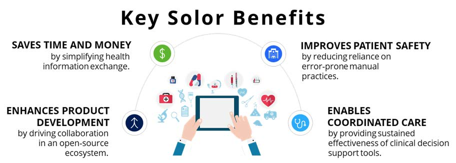
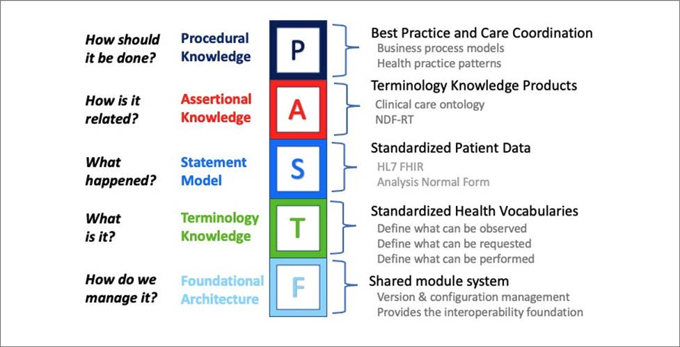

## Problem Statement

Health IT and Electronic Health Records (EHRs) improve patient safety by reducing medication errors, reducing adverse drug reactions, and improving compliance to practice guidelines. However, because different electronic health systems do not work together, they can sometimes do more harm than good.

> A study conducted by the Controlled Risk Insurance Company (CRICO), a medical professional liability organization, **identified 147 cases of medical error over five years in which an EHR was identified as a contributing factor**.

As a patient’s health record moves from one medical facility to another, clinical data is often lost because different organizations use different codes to represent medical data. As a result, organizations manually map data from one code to another to translate it, often resulting in information loss since **mapping may leave out critical information or add incorrect extra details**. The inaccuracy in mapping has led to erroneous clinical decisions and patient safety issues **resulting in a loss of $61 million in direct payments and legal expenses**. (Ref) As a result, there is an urgent need for widespread standards and consistent quality of health care. Due to the inherent complexity of health information systems, multi-disciplinary professionals engaged in the delivery, support, and engineering of safer health outcomes must address these error conditions and factors in ways that reduce the likelihood of unsafe events rather than superficially focusing only on single root causes (Ref). Health Care Organizations need to **implement terminology solutions that standardize the way data is represented in clinical statements**, ultimately paving the way to improved patient safety and reduced cost of care.

## High Reliability Organizations

High Reliability Organizations (HROs) such as aviation, nuclear power, and military operations rarely fail even though they encounter numerous unexpected events (Sullivan, et al., 2016). HROs in health care settings employ operating principles which reduce the frequency and severity of system failures leading to preventable patient harm including:
- **Sensitivity to Operations** which is the heightened awareness of the state of relevant systems and processes
- **Preoccupation with Failure** supports the management of unexpected or unknown failures by recognizing near miss events as opportunities to improve, rather than proof of success
- **Commitment to Resilience** allows HROs to anticipate, prioritize, and continuously improve processes, standards, and protocols for many unlikely, but possible, system failures
- **Deference to Expertise** encourages multi-disciplinary communication of expertise across inter-disciplinary teams with a focus on the impact to the frontline of patient care
- **Reluctance to Simplify** supports the spanning of boundaries, healthy skepticism, and differences of opinion.

In 2019, Veterans Health Administration (VHA) Executive in Charge, Dr. Richard Stone, set ambitious goals for achieving HRO performance across the VA health care system aimed at reducing preventable patient harm. Health information technology-supported quality improvement (QI) activities is one of the ways health systems such as VA work towards achieving HRO. However, these QI activities rely upon accurate clinical data represented in the VA systems of record (i.e., Cerner, VistA). High Reliability in health care requires high quality, appropriately detailed, and unambiguous data representations— and an ability to exchange that data using shared structures and common codification of data within those structures. Semantic interoperability, or the ability of computer systems to exchange data while retaining an intended meaning, has subsequently become a VA imperative:

- Over the next 10 years, VA will be caring for Veterans using two different EHR systems—Cerner and VistA—and must provide the same quality of care at all facilities, which requires semantically interoperable data exchange between all facilities independent of EHR system.
- The VA MISSION and Choice Acts expands Veterans’ access to community care. Coordinating care with these providers requires semantic interoperability outside of VA facilities.
- Highly Reliable Semantic Interoperability is a critical capability to enable the real-time and retrospective data analysis required of a Highly Reliable Organization caring for patients. 

Data quality and integrity are essential tenants for building and maintaining system trust and confidence among leadership, frontline providers, Veterans, and support staff. Health information technology-supported quality improvement (QI) activities is one of the ways health systems such as VA work towards achieving HRO outcomes.

## The Solor Project

The Solor Project is a VHA-funded terminology solution that brings together data-encoding standards in an extensible single model, **helping health care organization avoid errors in the use of clinical data and improve quality of care**. The Solor Project consists of the following collection of terminology solutions and initiatives that work together to translate, harmonize, and standardize clinical data so that it is reliably shared across systems:

- **Analysis Normal Form (ANF)**: Analysis Normal Form (ANF) is an HL7 informative logical model intended to represent a **normalized view of aggregate clinical statements** recorded during treatment for analysis, research, clinical decision support, and other purposes.
- **Terminology Knowledge Architecture (Tinkar)**: The Terminology Knowledge Architecture (Tinkar) project, currently within HL7’s Vocabulary Working Group, begins the work to define a **flexible selfdescribing standard logical model** for format and distribution of terminology knowledge bases.
- **Knowledge Management Environment (Komet)**: The Knowledge Management Environment (Komet) provides an **open-source ecosystem for management, harmonization, and extension of medical terminologies**, allowing users to import, transform, view, extend, and export content from disparate terminologies into a common model.

The Solor Project can address the gaps in mapping by providing highly reliable semantic interoperability, or in other words, **ensuring the exchange of medical information between different health care systems can be interpreted**.

Because Solor enables semantic interoperability, health care organizations can become **Highly Reliable Organizations (HROs)**. Solor’s HRO Approach includes:

- **Empowering Health Care Leaders**: Solor empowers health care providers and organizations by **providing a common data representation foundation**, which enables better decision support applications for improved patient care, patient monitoring, and patient outcomes.
- **Fostering Culture of Safety**: Solor operationalizes clinical integration, which fosters the reporting of potential safety threats and **promotes a just culture focused on removing hazards** that contribute to errors before they harm patients.
- **Developing Robust Process Improvements**: Solor prioritizes continuous improvement at every level through its open-source ecosystem that **enables health data integration and synchronization within a clinical environment**.

## Knowledge Architecture Introduction

Increased reliance on computerized health records, including Electronic Health Records Systems, requires standardized medical terminology to encode health information consistently across systems and enterprises. Clinicians require not only objective quantitative measurements (e.g., 90 beats per minute for a patient’s pulse), but also procedural context (e.g., pulse oximetry, manual) about past observations or requests for future interventions. While two quantitative measurements may be the same, the procedural information could indicate meaningful semantic differences and lead to different clinical interpretation and treatment. As information is exchanged across systems, the solution requires a common understanding of data, a method to support knowledge-representation, and clinical decision rules based on common terminology and statements. Each component must address an aspect, and together need to address the requirements of clinicians. Current HL7 standard implementations rely on profiles and templates to disambiguate statement and terminology, and provide sufficient precision for transactions, documents, and standards-based APIs. Therefore, the architectural approach described here is applicable to standards organizations developing interoperability for enterprise and project-specific implementations in equal measure. 

Functional decomposition—often referred to as a *Separation of Concerns (SoC)* —across components or sections with a specific purpose is a foundational design principle for complex system architecture. SoC allows a complete system to be subdivided into distinct sections or components with well-defined functionality and dependencies. If successful, this approach allows individual sections to be able to be *reused*, as well as designed, implemented, and updated *independently* to address emerging *requirements*. This is especially useful and important in a medical context given how many different health information and clinical terminology projects are ongoing at any given time. Efforts are often uncoordinated and led by disparate and unrelated standards development organizations. In these cases, SoC allows teams to work independently, in coordination with each other, and reuse the resulting artifacts.

*Separation of Concerns is an architectural design principle, whereby a system is divided into distinct sections, such that each section can address separate concerns. In this case, each architectural layer may build upon artifacts from lower layers.*

**Foundational Architecture** – The Foundational layer of the Knowledge Architecture provides the common elements of interoperability, such as: object identity, versioning, modularity, and knowledge representation. It includes (a) the foundation and building blocks of the common model; (b) how the repeatable transformation process of disparate standards into the common model promotes interoperability with other environments; and (c) how the modules of the architecture are tightly version controlled over time. The Tinkar Reference Model belongs in this layer.

**Terminology Knowledge** - The Terminology Knowledge layer is responsible for structured sets of medical terms and codes that define concepts of interest, including descriptions, dialects, language, and semantic hierarchy. SNOMED CT®, LOINC®, and RxNorm are part of this layer. It defines what valid codes or expressions may be used by higher level layers.

**Statement Model** – The Statement Model layer is responsible for defining how data elements are combined to create a statement. This layer reuses the artifacts defined in the Terminology Knowledge layer. The ANF Reference Model [11] belongs in this layer.

**Assertional Knowledge** – The Assertional Knowledge layer makes use of the Terminology Knowledge layer concepts to specify non-defining facts that may be used by procedural knowledge algorithms. An example fact might be that “thiazide diuretics treat hypertension.” Assertional Knowledge may also indicate what symptoms may be associated with a disorder.

**Procedural Knowledge** – The Procedural Knowledge layer, also known as imperative knowledge, is the knowledge exercised in the performance of some task. An example would be determining a hypertension treatment plan by analyzing a combination of a patient’s clinical statements and the available assertional knowledge. The procedural knowledge is responsible for information about standard ways to carry out specific procedures, as well as other procedural guidelines, (e.g., treatment protocols for diseases and order sets focused on certain patient situations). Procedural knowledge, together with assertional knowledge, enables clinical decision support, quality measurement, and patient safety. This layer relies on the architectural foundation and terminology layers, incorporates the statement model for information retrieval, and uses the assertional knowledge. Procedural knowledge artifacts may include clinical alert rules, reminders, etc., that trigger actions or recommend interventions.

Examining a clinical procedure for controlling hypertension illustrates each of the layers of the informatics architectural separation of concerns.

- At the Terminology Knowledge layer there may be various codes and terms from disparate source terminologies to define a concept (e.g., hypertension). Ideally, these overlapping codes and terms would be oriented to the same parent concept during the transformation and integration process at the Foundational Architecture layer.
- The Statement Model layer enables representation of blood pressure measurement values (e.g., systolic BP = 140 mmHg), or the categorical data (e.g., pregnancy induced hypertension vs. renal hypertension) within a standard data structure to facilitate information exchange or retrieval, such as within a standards- based clinical statement (i.e., CIMI, CDA, FHIR, ANF, etc.).
- The Assertional Knowledge layer represents non-procedural statements, or facts, such as “Stage 2 high blood pressure is over 140 systolic or 90 diastolic,” or “beta-blockers and ACE inhibitors may be used to treat hypertension”, or “beta-blockers are contraindicated in patients with a diagnosis of reactive airway disease.”
- Finally, the Procedural Knowledge layer provides algorithms to analyze clinical statements about a patient, in combination with the Assertional Knowledge, to recommend a treatment protocol for different kinds of hypertension, including the considerations of, (e.g., patient age, co-morbidities etc., which can be generated by an electronic clinical decision support system [Statement + Assertional layers]). This layer adds support for workflow and conditional logic (i.e., if-then-else).
A clear separation of concerns enables the isosemantic transformation of standards-based clinical statements to normal form in the Statement Model layer by decoupling structure from semantics and workflow.

HL7 relies on implementation guides (for V2, CDA, and FHIR) to add sufficient terminology knowledge to standards-based clinical statements. Terminology constraints documented as profiles or templates are the mechanism to create interoperable implementation guides from health IT standards. Only after the Terminology Knowledge is fully defined can the standards-based statements be used to support business and workflow decision points consistent with the Assertional and Procedural layers described above.